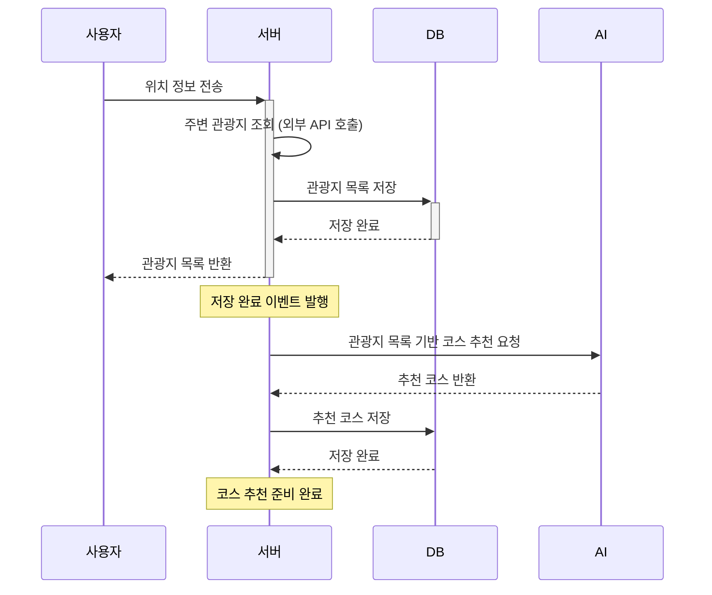
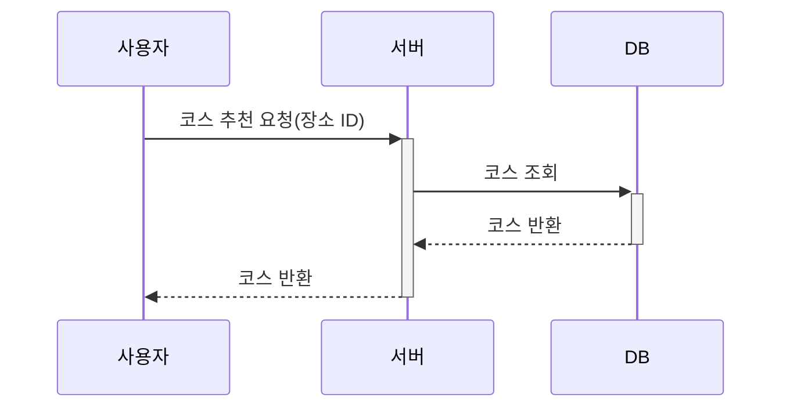

# 지도 페이지

- 주변 여행지 조회

```mermaid
sequenceDiagram
    participant  User as 사용자
    participant Server as 서버
    participant DB as DB
    participant AI as AI
    User ->>+ Server: 위치 정보 전송
    Server ->> Server: 주변 관광지 조회 (외부 API 호출)
    Server ->>+ DB: 관광지 목록 저장
    DB -->>- Server: 저장 완료
    Server -->>- User: 관광지 목록 반환
    Note over Server: 저장 완료 이벤트 발행
    
    Server ->> AI: 관광지 목록 기반 코스 추천 요청
    AI -->> Server: 추천 코스 반환
    Server ->> DB: 추천 코스 저장
    DB -->> Server: 저장 완료
    Note over Server: 코스 추천 준비 완료
```
- 추천 코스 조회

```mermaid
sequenceDiagram
    participant User as 사용자
    participant Server as 서버
    participant DB as DB
    User ->>+ Server: 코스 추천 요청(장소 ID)
    Server ->>+ DB: 코스 조회
    DB -->>- Server: 코스 반환
    Server -->>- User: 코스 반환
```

[index](../index.md)